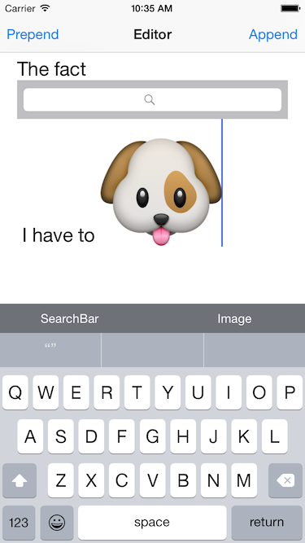
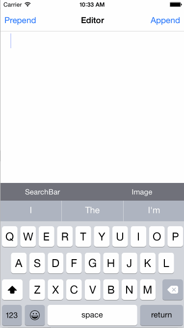

# RTViewAttachment

[](https://travis-ci.org/rickytan/RTViewAttachment)
[](http://cocoapods.org/pods/RTViewAttachment)
[](http://cocoapods.org/pods/RTViewAttachment)
[](http://cocoapods.org/pods/RTViewAttachment)

## Introduction

Since **iOS 7**, developers can attach a `NSTextAttachemnt` to a `UITextView`, and it will display as an image. What if I want to attach a `UIView` to a text editor, and it can layout with all other text?

Here comes a solution. This project is based on `NSTextAttachment`, and no private API is used, no Black Magic.



;

## Example

To run the example project, clone the repo, and run `pod install` from the Example directory first.

## Requirements

- **iOS 7** and up
- **Xcode 7** and up

## Installation

RTViewAttachment is available through [CocoaPods](http://cocoapods.org). To install
it, simply add the following line to your Podfile:

```ruby
pod "RTViewAttachment"
```

## Author

Ricky Tan, ricky.tan.xin@gmail.com

## License

RTViewAttachment is available under the MIT license. See the LICENSE file for more info.
